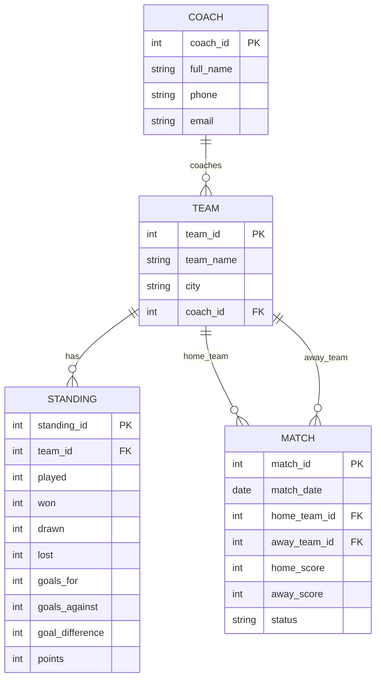

```mermaid
erDiagram

    TEAM {
        int team_id PK
        string team_name
        string city
        int coach_id FK
    }

    COACH {
        int coach_id PK
        string full_name
        string phone
        string email
    }

    MATCH {
        int match_id PK
        date match_date
        int home_team_id FK
        int away_team_id FK
        int home_score
        int away_score
        string status
    }

    STANDING {
        int standing_id PK
        int team_id FK
        int played
        int won
        int drawn
        int lost
        int goals_for
        int goals_against
        int goal_difference
        int points
    }

    COACH ||--o{ TEAM : coaches
    TEAM ||--o{ STANDING : has
    TEAM ||--o{ MATCH : home_team
    TEAM ||--o{ MATCH : away_team
```
